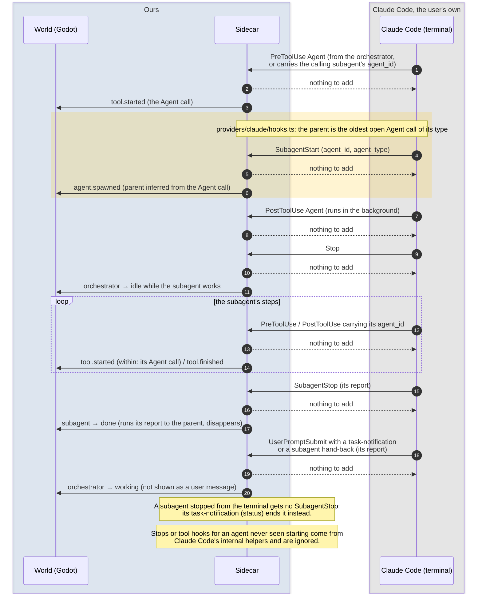

# 5. A subagent

[All diagrams](../../flows.md)

> **Status:** Built (S02, A02; `within` from C04). NOTES.md → S02, A02.

```mermaid
sequenceDiagram
    autonumber

    box rgba(47,111,191,0.12) Ours
        participant World as World (Godot)
        participant Sidecar
    end

    box rgba(128,128,128,0.14) Claude Code, the user's own
        participant Claude as Claude Code (terminal)
    end

    Claude->>Sidecar: PreToolUse Agent (from the orchestrator,<br/>or carries the calling subagent's agent_id)
    Sidecar-->>Claude: nothing to add
    Sidecar->>World: tool.started (the Agent call)
    rect rgba(255,193,7,0.18)
        Note over Sidecar,Claude: providers/claude/hooks.ts: the parent is the oldest open Agent call of its type
        Claude->>Sidecar: SubagentStart (agent_id, agent_type)
        Sidecar-->>Claude: nothing to add
        Sidecar->>World: agent.spawned (parent inferred from the Agent call)
    end
    Claude->>Sidecar: PostToolUse Agent (runs in the background)
    Sidecar-->>Claude: nothing to add
    Claude->>Sidecar: Stop
    Sidecar-->>Claude: nothing to add
    Sidecar->>World: orchestrator → idle while the subagent works
    loop the subagent's steps
        Claude->>Sidecar: PreToolUse / PostToolUse carrying its agent_id
        Sidecar-->>Claude: nothing to add
        Sidecar->>World: tool.started (within: its Agent call) / tool.finished
    end
    Claude->>Sidecar: SubagentStop (its report)
    Sidecar-->>Claude: nothing to add
    Sidecar->>World: subagent → done (runs its report to the parent, disappears)
    Claude->>Sidecar: UserPromptSubmit with a task-notification<br/>or a subagent hand-back (its report)
    Sidecar-->>Claude: nothing to add
    Sidecar->>World: orchestrator → working (not shown as a user message)
    Note over Sidecar: A subagent stopped from the terminal gets no SubagentStop:<br/>its task-notification (status) ends it instead.
    Note over Sidecar: Stops or tool hooks for an agent never seen starting come from<br/>Claude Code's internal helpers and are ignored.
```
