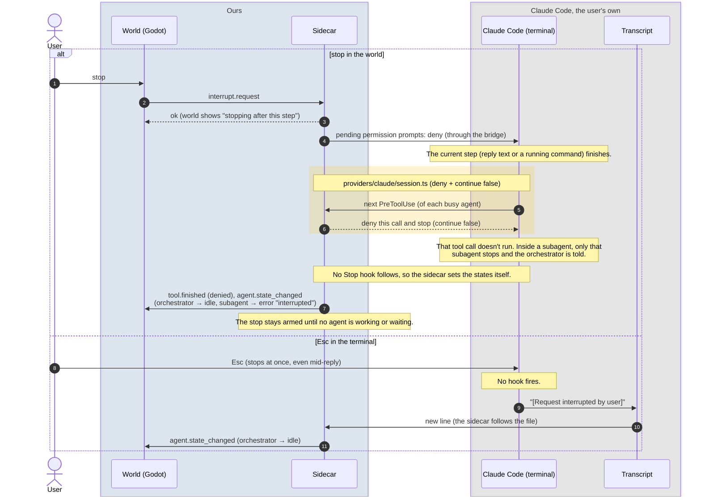

# 6. Stopping

[All diagrams](../../flows.md)

> **Status:** Built (S02). NOTES.md → S02.

```mermaid
sequenceDiagram
    autonumber
    actor User

    box rgba(47,111,191,0.12) Ours
        participant World as World (Godot)
        participant Sidecar
    end

    box rgba(128,128,128,0.14) Claude Code, the user's own
        participant Claude as Claude Code (terminal)
        participant Log as Transcript
    end

    alt stop in the world
        User->>World: stop
        World->>Sidecar: interrupt.request
        Sidecar-->>World: ok (world shows "stopping after this step")
        Sidecar->>Claude: pending permission prompts: deny (through the bridge)
        Note over Claude: The current step (reply text or a running command) finishes.
        rect rgba(255,193,7,0.18)
            Note over Sidecar,Claude: providers/claude/session.ts (deny + continue false)
            Claude->>Sidecar: next PreToolUse (of each busy agent)
            Sidecar-->>Claude: deny this call and stop (continue false)
        end
        Note over Claude: That tool call doesn't run. Inside a subagent, only that<br/>subagent stops and the orchestrator is told.
        Note over Claude,Sidecar: No Stop hook follows, so the sidecar sets the states itself.
        Sidecar->>World: tool.finished (denied), agent.state_changed<br/>(orchestrator → idle, subagent → error "interrupted")
        Note over Sidecar: The stop stays armed until no agent is working or waiting.
    else Esc in the terminal
        User->>Claude: Esc (stops at once, even mid-reply)
        Note over Claude: No hook fires.
        Claude->>Log: "[Request interrupted by user]"
        Log->>Sidecar: new line (the sidecar follows the file)
        Sidecar->>World: agent.state_changed (orchestrator → idle)
    end
```
